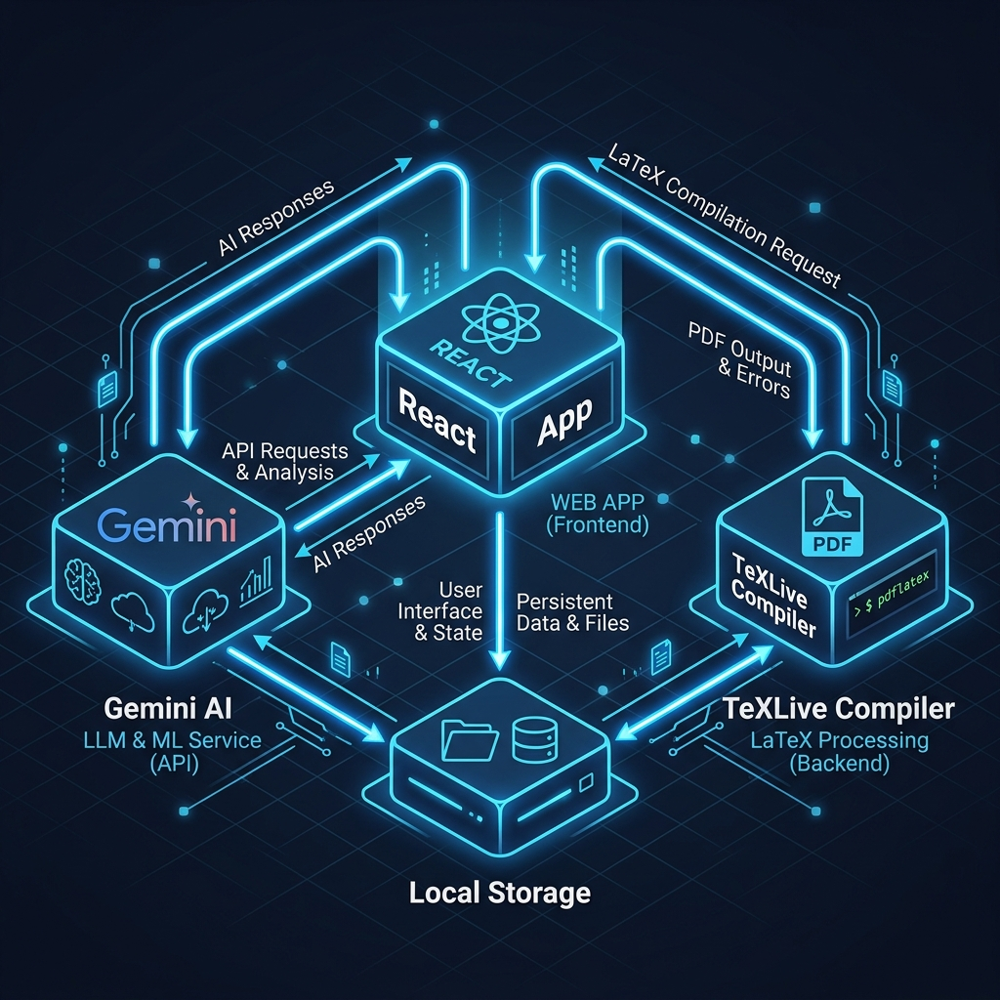
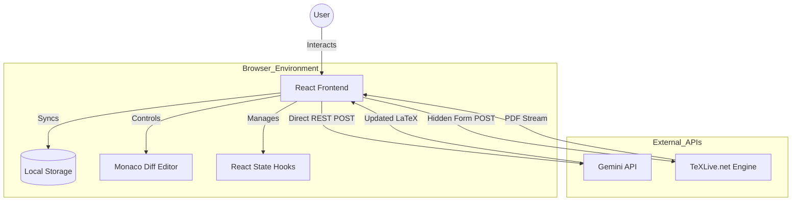

# System Design & Architecture: Zenith-LaTeX

This document outlines the technical architecture, data flow, and design patterns used in the **Zenith-LaTeX** application.

---

## 1. System Overview
The application is a **Client-Side Heavy, Serverless Web App**. It is designed to be highly scalable with zero operational costs by shifting all processing (AI calls and PDF compilation) to external APIs and the user's browser.

### Tech Stack:
- **UI Framework:** React (Vite)
- **Editor:** Monaco Editor (@monaco-editor/react)
- **AI Engine:** Google Gemini Pro API (REST)
- **LaTeX Engine:** TeXLive.net (CGI/Form POST)
- **Styling:** Vanilla CSS (Glassmorphism design)

---

## 2. High-Level Architecture Diagram

---

## 3. Component Breakdown

### A. State Management & Persistence
The app uses a **Single Source of Truth** pattern. 
- **React State:** Manages transient data (loading states, current input, active tabs).
- **Local Storage:** Acts as the persistence layer for `latexCode`, `originalCode`, and `chatHistory`. This ensures that even without a backend database, user data survives browser refreshes.

### B. The AI Orchestration Layer
Located in `ChatInterface.jsx`, this layer handles communication with Gemini.
- **Prompt Injection:** Every user request is wrapped in a "System Instruction" block that enforces LaTeX-only output and ATS-friendly content standards (STAR method).
- **History Management:** Maintains a sliding window of chat messages to provide context-aware suggestions.

### C. The "CORS-Bypass" PDF Pipeline
This is the most critical technical innovation in the app.
- **Problem:** Standard `fetch` calls to `texlive.net` fail due to CORS.
- **Solution:** The app utilizes a hidden HTML Form.
  1. The `latexCode` is injected into a `<textarea>` within a hidden form.
  2. The form `target` is set to a hidden `<iframe>`.
  3. Form submission triggers a browser-native POST that bypasses CORS restrictions.
  4. The generated PDF renders directly inside the iframe.

### D. Monaco Diff Engine
The app leverages `@monaco-editor/react` to provide a dual-pane diffing experience.
- It calculates the line-by-line difference between `originalCode` (snapshot before update) and `latexCode` (post-AI update).
- This allows for a "Code Review" workflow where users must explicitly click "Accept Changes" to commit AI suggestions.

---

## 4. Data Flow Lifecycle

1. **Input:** User types a request in the chat.
2. **AI Processing:** React sends the current LaTeX + user request + history to Gemini.
3. **Diff Generation:** Gemini returns new code; React updates the `latexCode` state. Monaco instantly highlights the changes.
4. **Verification:** User reviews the diff and clicks "Accept Changes."
5. **Compilation:** User switches to PDF tab; React submits the hidden form to TeXLive.
6. **Output:** User views the PDF and clicks "Download" to trigger a new-tab PDF stream for saving.

---

## 5. Security & Privacy Model

- **BYOK (Bring Your Own Key):** The application does not store API keys on any server. Users provide their own keys, which are stored only in their `localStorage`.
- **Stateless Backend:** There is no application backend. All data processing happens either in the user's browser or via encrypted HTTPS calls directly to Google/TeXLive.
- **Zero Data Harvesting:** The creator of the app has no access to the users' resumes or API usage.

---
**Created by Shubham Reddy**
*System Design Document for Zenith-LaTeX*
